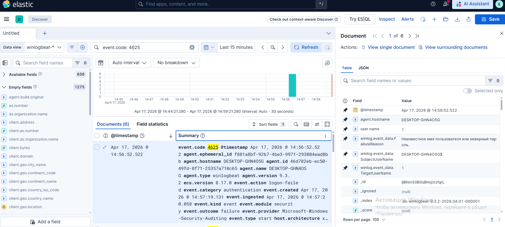
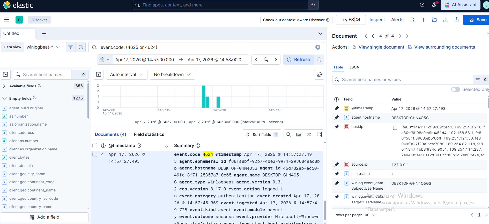
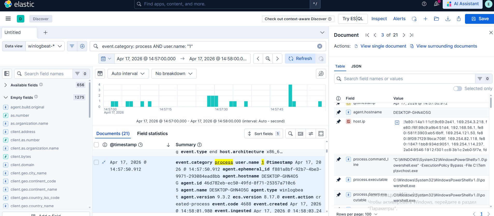
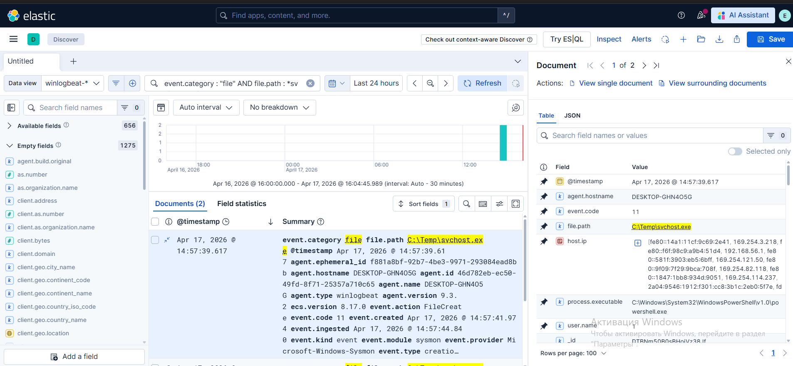
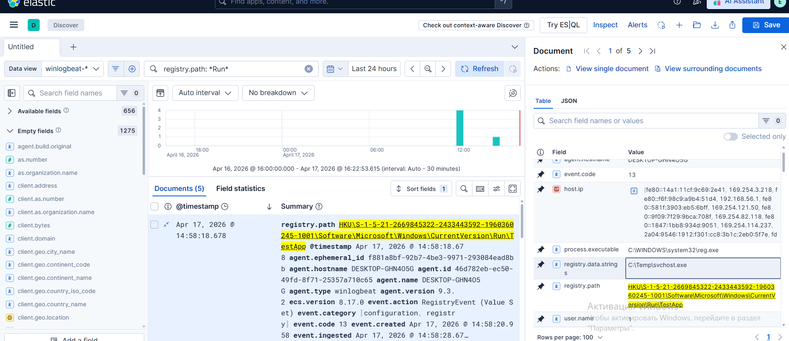

### 1) Обнаружение брутфорса (Threat Hunting)
В ходе планового Threat Hunting по поиску аномалий (Event ID 4625) обнаружена подозрительная активность: 6 неудачных попыток входа.  
**Фильтр:** `event.code: 4625`  
- **Время:** Apr 17, 2026 @ 14:56:43.567  
- **User:** 1  
- **Source IP:** 127.0.0.1  

**Техника MITRE:** [T1110.001 (Brute Force)](https://mitre.org)  

---

### 2) Успешный вход
Проверка на успешный вход после брутфорса.  
**Фильтр:** `event.code: (4625 or 4624)`  
- **Время успеха:** 14:57:27.493  
- **LogonType:** 2 (локальный вход)  
Успех подтверждается совпадением IP и имени пользователя.  

---

### 3) Анализ запущенных процессов
Поиск активности после входа.  
**Фильтр:** `event.category: process AND user.name: "1"`  
Обнаружен запуск подозрительной команды:  
`powershell.exe -ExecutionPolicy Bypass -File C:\Temp\svchost.exe`  
**Аномалия:** Запуск системного имени из папки `Temp`.

**Техники MITRE:**  
- [T1059.001 (PowerShell)](https://mitre.org)  
- [T1036.005 (Masquerading)](https://mitre.org)  

---

### 4) Источник файла (File Creation)
Выяснение происхождения файла.  
**Фильтр:** `event.category: "file" AND file.path: *svchost.exe*`  
- **Событие:** Event ID 11 (создание файла).  
- **Тайминг:** Файл создан за 11 секунд до запуска.  
- **Инициатор:** `powershell.exe`.  

---

### 5) Закрепление в системе (Persistence)
Проверка изменений в реестре.  
**Время:** 14:58:18.678  
Обнаружено создание ключа автозагрузки:  
- **Path:** `...CurrentVersion\Run\TestApp`  
- **Data:** `C:\Temp\svchost.exe`  

**Техника MITRE:** [T1547.001 (Registry Run Keys)](https://mitre.org)  

---

### Рекомендации (Remediation)
1. **Изоляция:** Удалить файл `C:\Temp\svchost.exe` и ключ реестра `TestApp`.
2. **Аккаунт:** Сбросить пароль пользователя «1».
3. **Hardening:** 
   - Настроить политику блокировки за брутфорс.
   - Ограничить PowerShell (Constrained Language Mode).
   - Создать SIEM-алерт на создание `.exe` в `C:\Temp\`.
